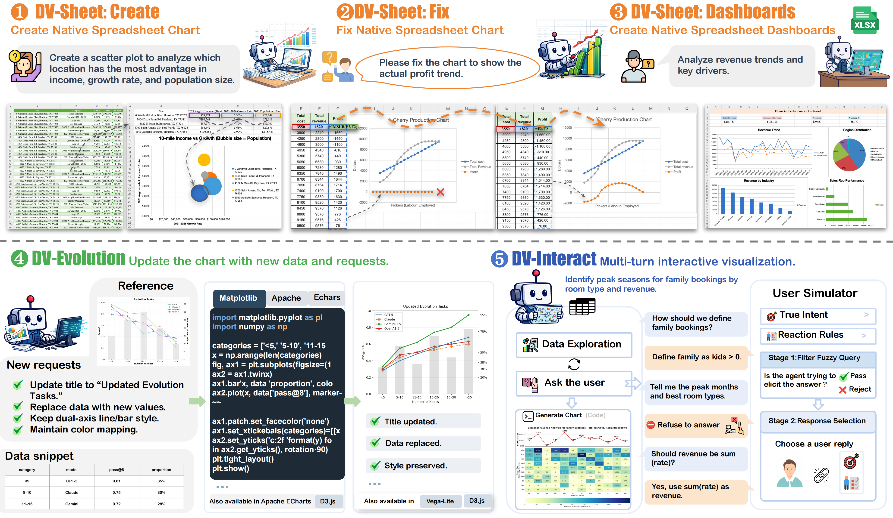

<div align="center">
  <h1 align="center">DV-World</h1>
  <p align="center">
    A benchmark and baseline workspace for data visualization agents across
  </p>
  <p>
    &nbsp;&nbsp;🌐 <a href="">Website</a>&nbsp;&nbsp;|&nbsp;&nbsp;
    📑 <a href="">Paper</a>&nbsp;&nbsp;|&nbsp;&nbsp;
    🤗 <a href="https://huggingface.co/DV-World">Dataset</a>&nbsp;&nbsp;|&nbsp;&nbsp;
    🐥 <a href="">Twitter</a>&nbsp;&nbsp;
  </p>
</div>

## 📰 News 
- **2025-12-08**: 🔥 We release the [DV-World dataset]() and the [paper]().


## Overview

DV-World is a benchmark-oriented repository for studying data visualization agents under three complementary settings:

- **DV-Evolution**: generate target visualizations and structured outputs from task specifications
- **DV-Interact**: solve visualization tasks through multi-turn interaction, including user-simulator feedback
- **DV-Sheet**: operate on spreadsheet-centric visualization tasks, including chart creation, dashboard understanding, and workbook repair


<div align="center">
  
</div>


## 🔍 Installation
Set up the environment using the following commands:
```
conda create -n dvworld python=3.12
conda activate dvworld

pip install -r requirements.txt
```


## 🚀  Quick access DV-World Dataset

The dataset is hosted at:

`https://huggingface.co/datasets/DV-World/dvworld`

After downloading, place the files into the corresponding `gold` and `tasks` folders:

- `dv-evolution/gold` and `dv-evolution/tasks`
- `dv-interact/gold` and `dv-interact/tasks`
- `dv-sheet/gold` and `dv-sheet/tasks`


## 🚀 Quickstart 

Each task family has its own baseline runner:

- `dv-evolution/dvworld-agent-evolution`
- `dv-interact/dvworld-agent-interact`
- `dv-sheet/dvworld_agent_sheet`

The typical workflow is:

1. Download the dataset into the task-specific `gold` and `tasks` folders.
2. Configure the model in `dvworld_agent_fcmode/agent/config.py` inside the corresponding agent directory.
3. Run the agent with `run.py`.
4. Convert raw outputs into evaluation format with `get_results.py`.
5. Evaluate the converted results with the matching script in `evaluation_suite`.

Agent-specific usage guides:

- [dv-evolution/dvworld-agent-evolution/README.md](dv-evolution/dvworld-agent-evolution/README.md)
- [dv-interact/dvworld-agent-interact/README.md](dv-interact/dvworld-agent-interact/README.md)
- [dv-sheet/dvworld_agent_sheet/README.md](dv-sheet/dvworld_agent_sheet/README.md)

## ⚖️ Evaluation

Evaluation is organized by task family inside `evaluation_suite`.

Converted candidate outputs are expected under:

```bash
evaluation_suite/results/<run_name>
```

Evaluation outputs are written to:

```bash
evaluation_suite/model_score/<run_name>
```

Task-specific evaluators:

- `evaluation_suite/dv_evolution/run_eval.py`
- `evaluation_suite/dv_interact/run_eval.py`
- `evaluation_suite/dvsheet_create/run_eval.py`
- `evaluation_suite/dvsheet_dashboards/run_eval.py`
- `evaluation_suite/dvsheet_fix/run_eval.py`

Evaluation guides:

- [evaluation_suite/dv_evolution/README.md](evaluation_suite/dv_evolution/README.md)
- [evaluation_suite/dv_interact/README.md](evaluation_suite/dv_interact/README.md)
- [evaluation_suite/dvsheet_create/README.md](evaluation_suite/dvsheet_create/README.md)
- [evaluation_suite/dvsheet_dashboards/README.md](evaluation_suite/dvsheet_dashboards/README.md)
- [evaluation_suite/dvsheet_fix/README.md](evaluation_suite/dvsheet_fix/README.md)


## ⚠️ Platform Notes

- `DV-Evolution` and `DV-Interact` can be run in a standard Python environment.
- `DV-Sheet` evaluation should be run on **Windows**.
- In particular, `dvsheet-create`, `dvsheet-dashboards`, and `dvsheet-fix` rely on Excel-related workflows during evaluation.


# 📋 Leaderboard Submission
To submit your agent results to the leaderboard, please follow the instructions in  [DAComp Submission Guidelines]().


# ✍️ Citation
If you find our work helpful, please cite as
```

```